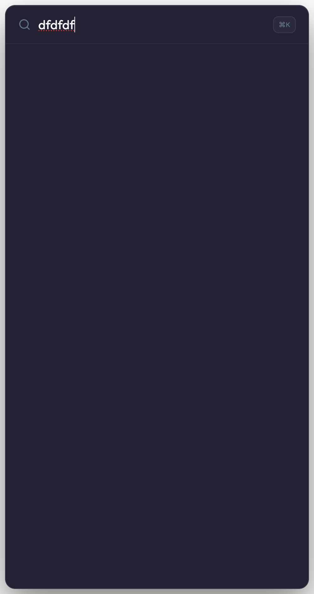
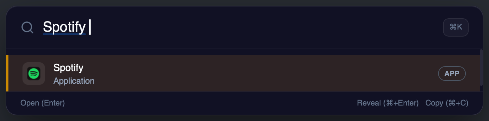

# Spotlight Genie

<p align="center">
  
</p>

<p align="center">
  <strong>Spotlight speed. Alfred flexibility. Cross-platform simplicity.</strong><br/>
  Spotlight Genie is a keyboard-first launcher for macOS, Windows, and Linux, powered by Tauri + Rust for native performance.
</p>

<p align="center">
  <a href="https://github.com/clarezoe/spotlight-genie/stargazers"></a>
  <a href="https://github.com/clarezoe/spotlight-genie/network/members"></a>
  <a href="https://github.com/clarezoe/spotlight-genie/issues"></a>
  <a href="https://github.com/clarezoe/spotlight-genie/commits/main"></a>
</p>

## Start in 30 Seconds

```bash
pnpm install
pnpm tauri dev
```

Build release:

```bash
pnpm tauri build
```

Support the project:

[](https://buymeacoffee.com/clarezoe)

## What Makes It Great

- Global hotkey launcher (`Cmd+Space` / `Ctrl+Space`)
- Fast fuzzy app discovery with native app icons on macOS
- Configurable file search folders + file-type specific icons
- Inline calculator, currency conversion, and web fallback
- Modern floating UI with keyboard-first navigation
- Tray menu, hide-on-blur behavior, and position persistence

## Real Screenshots

### Search UI (empty state)



### Search UI (query in progress)



## Repository Stats


## Star History

[](https://star-history.com/#clarezoe/spotlight-genie&Date)

## Built-In Features

| Category | Highlights |
|---|---|
| Launcher | Global toggle, instant focus, keyboard-first flow |
| Search | Apps, files, commands, plugin results, contacts |
| Productivity | Calculator, currency conversion, web fallback |
| Visual Quality | Native corners, theming, icon rendering |
| Settings | Persistent settings panel with folder management and plugin controls |
| Menu | Tray menu with quick access to settings and window controls |

## Built-In Plugins

| Plugin | Keyword | Description |
|---|---|---|
| Spotify | `sp` | Music control and quick access actions |
| Currency | `cc` | Real-time conversions and natural query support |
| Clipboard | `cb` | Search and trigger clipboard-based actions |
| Contacts | `contact` | Search macOS contacts by name, email, or phone |

## Tech Stack

| Layer | Technology |
|---|---|
| Desktop | Tauri 2.x |
| Backend | Rust |
| Frontend | Vue 3 + TypeScript + Vite |
| Styling | TailwindCSS 4 |
| Icons | Lucide Vue |
| Package Manager | pnpm |

## Prerequisites

- Node.js `20+`
- pnpm `10+`
- Rust `1.87+`

## Output Artifacts

- macOS App: `src-tauri/target/release/bundle/macos/Spotlight Genie.app`
- macOS DMG: `src-tauri/target/release/bundle/dmg/Spotlight Genie_0.1.0_aarch64.dmg`

## Project Structure

```text
spotlight-genie/
├─ src/             # Vue frontend
├─ plugins/         # TS plugins
├─ src-tauri/       # Rust backend + Tauri config
└─ assets/          # README screenshots and media
```

## Contributing

1. Fork the repository
2. Create your feature branch: `git checkout -b feat/your-feature`
3. Commit your changes: `git commit -m "feat: your change"`
4. Push your branch and open a PR

## Support This Project

If Spotlight Genie improves your daily workflow, you can support development here:

- [https://buymeacoffee.com/clarezoe](https://buymeacoffee.com/clarezoe)
